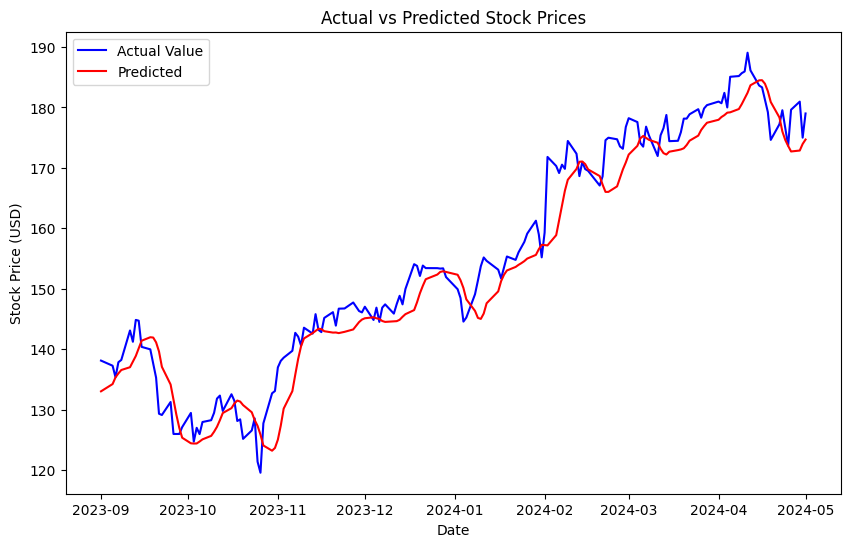

# Stock Market Predictor 
A stock market prediction project using LSTM. The LSTM model was built using Tensorflow and its performance was evaluated via MSE and MAPE. 

## Preview


## Usage
1. Download or clone the repo:
```git clone https://github.com/luciavu/stock-market-predictor.git```


2. Install the necessary dependencies: 
```pip install -r requirements.txt```


3. Download the relevant historical CSV stock data from  ```https://au.finance.yahoo.com/``` you want to train the model on.

4. Replace the sample data read with your data path.

5. Run the script in Jupyter Notebook to make predictions on new data.